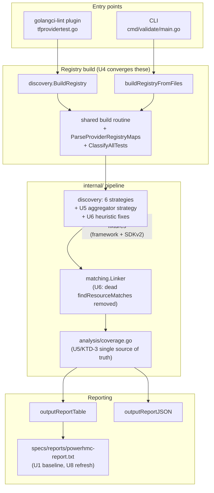

# refactor: Linter correctness pass + powerhmc validation onboarding

> **Home repo:** `golangci-lint-tfproviderframework` (all repo-relative paths below are in this repo unless stated).
> **Validation input repo:** `terraform-provider-powerhmc` — currently at the external path `/Users/simon.lynch/git/IBM/terraform-provider-powerhmc`. Its source is copied into this repo under `validation/terraform-provider-powerhmc/` as part of U1; no code in the target repo is modified.

---

## Summary

Two coupled workstreams against the test-coverage linter:

1. **Validate against `powerhmc`** — onboard `terraform-provider-powerhmc` (a small, pure-`terraform-plugin-framework` provider: 3 resources, 3 data-source files, partial tests) as a validation provider, generate `specs/reports/powerhmc-report.txt`, and **hand-verify** that discovery and test-matching are actually correct — not merely that the tool runs.
2. **Review and update `main`** — a correctness/quality pass driven by concrete findings, with **test-first execution** to honor the repo's own `AGENTS.md` rule. This covers: deleting dead/duplicate code, fixing a plugin-vs-CLI discovery divergence, unifying three overlapping coverage computations, fixing fragile discovery/matching heuristics (several of which `powerhmc` demonstrably triggers), and **backfilling the missing `internal/` unit tests and `analysistest` golden suites**.

`powerhmc` is not just a test subject — it is the forcing function. Its lowercase unexported receiver types, its `Metadata()` TypeName divergence, and its unregistered-but-present `lpar_data_source.go` each exercise a different fragile seam in the linter. The validation baseline (U1) is therefore sequenced first and feeds the fix units with reproducible evidence.

---

## Problem Frame

The linter is a dual-mode tool (golangci-lint plugin via `tfprovidertest.go` + standalone CLI via `cmd/validate/main.go`) sharing an `internal/` pipeline: **discovery → parse → match → report**. Research (repo-research + learnings agents, 2026-06-05) surfaced a consistent picture: the analysis engine is feature-rich but carries accumulated debt that produces silent correctness drift, and its own test discipline has gaps that let that drift go undetected.

Concretely:

- **No `internal/` or `pkg/` tests exist.** The 6 discovery strategies, the per-pass registry cache, and the linker are exercised only indirectly through root-package tests that import exported APIs. There are no `analysistest` golden suites and no fixtures for an SDKv2-only provider or a `Resources()`-aggregator-only provider. This directly violates the repo's `AGENTS.md` ("write tests first").
- **The plugin and CLI build the registry via two divergent code paths.** `internal/discovery.BuildRegistry` (plugin) does not call `ParseProviderRegistryMaps` or `ClassifyAllTests`, while `cmd/validate/main.go`'s `buildRegistryFromFiles` does — so the same provider yields different discovery results depending on entry point.
- **Three overlapping coverage computations** exist (analyzer `pass.Reportf` path, `internal/analysis/coverage.go`, and the CLI's `outputReportTable`/`outputReportJSON`), and the JSON vs table paths compute `MissingCheckDestroy` differently and can disagree.
- **Fragile heuristics** misfire on real providers: `hasImportStateMethod` hardcodes a capitalized `<Title>Resource` receiver (false-negatives on unexported types like `powerhmc`'s), SDKv2 data sources are classified by filename only, and `t.Skip()`-gated tests are counted as real coverage.
- **Dead/duplicate code** clutters the tree: root `report.go` duplicates `internal/analysis/report.go` (both unused by the analyzers), `registry.go.backup`, the stubbed `findResourceMatches` (returns empty — a silent false-negative trap), placeholder `runDiagnostics` flags, plus checked-in 5 MB binaries and `.DS_Store`.

Why now: a new provider needs validating, and that validation is the cheapest possible way to expose these seams with reproducible evidence before they cause wrong coverage numbers in the field.

---

## Scope Boundaries

**In scope**
- Onboarding `powerhmc` into `validation/` and `specs/reports/`, with hand-verification of discovery/matching correctness.
- Correctness fixes for: plugin/CLI registry parity, coverage-computation unification, and the discovery/matching heuristic bugs named above.
- Dead/duplicate-code removal.
- Backfilling `internal/` unit tests and an `analysistest` golden-suite harness (framework fixture mirroring `powerhmc` + an SDKv2 fixture).
- The still-open prior-review items FIX-010 (custom `resource.Test()` wrapper helpers ignored) and FIX-011 (empty-string name extraction).
- A repeatable report-regeneration mechanism and documentation of the onboarding process in `AGENTS.md`.

**Out of scope (true non-goals)**
- Changing the linter's *diagnostic rule set* or adding new lint checks.
- Modifying any code in `terraform-provider-powerhmc` (it is a read-only validation input).
- Re-architecting the dual-mode (plugin + CLI) design into a single entry point.

### Deferred to Follow-Up Work
- Replacing the `interface{}`-typed Linker settings + reflection-based `isFuzzyMatchingEnabled` with a typed interface (noted by research; orthogonal to correctness, larger refactor).
- Adding the missing `terraform-provider-random` source (its `specs/reports/random-report.txt` is currently an error stub) — fix or remove as a separate cleanup.
- FIX-013 (un-skipping `t.Skip()`'d critical tests) beyond what U6's skip-detection work touches.
- Consolidating `toTitleCase` (defined twice with different semantics in `internal/discovery/utils.go` and `internal/analysis/diagnostics.go`) — fold in opportunistically if a touched unit crosses it, otherwise defer.

---

## Key Technical Decisions

**KTD-1 — Validation first, as a diagnostic baseline.** U1 runs before any fix so the fixes are evidence-driven and so we have a before/after artifact (`specs/reports/powerhmc-report.txt`) proving each fix changed the right number. Rationale: the research flagged that committed reports are the project's de-facto regression-detection artifact; we make that explicit.

**KTD-2 — Test-first per the repo's own rule.** Every fix unit (U4–U7) carries a test-first `Execution note`. The `analysistest` harness + `internal/` unit-test scaffolding (U3) is sequenced before the fix units so test-first is mechanically possible. Rationale: `AGENTS.md` mandates it and the absence of `internal/` tests is the root cause of undetected drift.

**KTD-3 — Unify, don't add, coverage computations.** Collapse the three overlapping computations onto `internal/analysis/coverage.go` as the single source of truth; the CLI table/JSON renderers and the analyzer path call into it. Rationale: divergence is the bug; a fourth path would make it worse. (See origin research: JSON vs table `MissingCheckDestroy` mismatch.)

**KTD-4 — Fix plugin/CLI divergence by sharing the build path, not duplicating the fix.** `BuildRegistry` (plugin) and `buildRegistryFromFiles` (CLI) converge on one registry-construction routine that always runs `ParseProviderRegistryMaps` + `ClassifyAllTests`. Rationale: patching only one side re-creates the divergence the next time discovery changes.

**KTD-5 — Add an aggregator-reading discovery strategy, but keep per-resource discovery authoritative.** A new strategy reads `func (p *Provider) Resources()/DataSources()/Actions()` constructor slices to (a) confirm discovered resources and (b) flag discovered-but-unregistered types (like `powerhmc`'s `lpar_data_source.go`). It does not replace the Schema/Metadata/factory strategies. Rationale: registration is ground truth for *what ships*; per-resource discovery is ground truth for *what exists in source*. Surfacing the delta is more useful than silently picking one.

**KTD-6 — `powerhmc` becomes a permanent validation fixture.** Its source is vendored under `validation/` and its report committed, joining the existing ~9 providers. Rationale: it is the only pure-framework provider with the unexported-receiver + TypeName-divergence shape; keeping it guards those code paths against regression.

---

## High-Level Technical Design

The fix targets cluster on the shared pipeline. The diagram shows where each unit intervenes and the plugin/CLI convergence (KTD-4).

Directional only — the prose and per-unit fields are authoritative where they disagree.

---

## Implementation Units

### U1. Onboard `powerhmc` and establish the validation baseline

**Goal:** Vendor `powerhmc` into the validation set, generate its coverage report, and hand-verify discovery/matching against the known source shape — producing a documented findings list that drives U4–U7.

**Requirements:** Workstream A; provides reproducible evidence for KTD-1.

**Dependencies:** none (runs first).

**Files:**
- `validation/terraform-provider-powerhmc/` (new — vendored source copy)
- `specs/reports/powerhmc-report.txt` (new — generated baseline)
- `docs/plans/2026-06-05-001-...-findings.md` (new — hand-verification findings; or append a "Validation Findings" section to `validation/VALIDATION_REPORT.md`)

**Approach:**
- Copy the provider source from `/Users/simon.lynch/git/IBM/terraform-provider-powerhmc` into `validation/terraform-provider-powerhmc/`, mirroring how the existing 9 providers are vendored (full source tree; the linter scans `internal/provider`).
- Generate the report via the CLI: `validate -provider validation/terraform-provider-powerhmc -recursive -report` → `specs/reports/powerhmc-report.txt`.
- **Hand-verify against ground truth** (from source inspection):
  - Resources expected: `system_config` (tested), `vios` (tested), `lpar` (**untested** — no `lpar_resource_test.go`).
  - Data-source *files*: `system_config_data_source.go`, `vios_data_source.go`, `lpar_data_source.go` — but `DataSources()` registers only `NewSystemConfigDataSource` + `NewViosDataSource` (`lpar_data_source` is **present but unregistered**).
  - `systemConfigDataSource.Metadata()` sets TypeName `_sys_config` (≠ type-derived `system_config`) — confirm the `MetadataMethodStrategy` override wins.
  - Receiver types are **lowercase unexported** (`lparResource`, `viosResource`, `systemConfigDataSource`).
- Record each discrepancy between report output and ground truth as a finding with the suspected root cause and the unit that will fix it.

**Patterns to follow:** `validation/terraform-provider-bcm/` (existing framework-provider fixture); report convention in `specs/reports/*-report.txt`; baselines documented in `validation/VALIDATION_REPORT.md` and `README.md`.

**Execution note:** Diagnostic-first — this unit deliberately changes no linter code. Its output is the evidence base for U4–U7.

**Test scenarios:**
- `Test expectation: none -- diagnostic/onboarding unit; it generates an artifact and a findings list, adds no behavior.` Correctness is verified by the hand-verification checklist above, not by a Go test. (The regression test that locks `powerhmc`'s expected numbers lands in U3/U8 once fixes have stabilized the output.)

**Verification:** `specs/reports/powerhmc-report.txt` exists and parses; every row in the hand-verification checklist is marked correct/incorrect with a root-cause note; the findings list enumerates which of U4–U7 each defect maps to.

---

### U2. Remove dead and duplicate code

**Goal:** Delete code that is unused, duplicated, or stubbed, so the correctness units operate on a clean tree and so the duplication-driven divergence risk shrinks.

**Requirements:** Workstream B (cleanup); reduces the surface area U3–U7 must reason about.

**Dependencies:** none (independent of U1, but land after U1 so the baseline report is generated against the current tree first).

**Files:**
- `report.go` (delete — byte-for-byte duplicate of `internal/analysis/report.go`, unused by analyzers)
- `report_test.go` (retarget to `internal/analysis/report.go` or delete if that path is also removed — confirm which `Report`/`FormatReport` survives)
- `registry.go.backup` (delete — stale checked-in backup)
- `internal/matching/linker.go` — remove `findResourceMatches` (the fully-stubbed no-op matcher, ~lines 327–358)
- `cmd/validate/main.go` — remove or implement the `runDiagnostics` placeholder flags (`-show-matches/-show-unmatched/-show-orphaned`) and their `//nolint:unused` `outputMatches*` helpers; prefer **remove** unless a finding shows users rely on them
- `tfprovidertest`, `validate`, `bin/validate` (delete checked-in binaries; add to `.gitignore`)
- `.DS_Store` (delete; ensure `.gitignore` covers it)

**Approach:**
- For each deletion, confirm zero live references (`grep` for the symbol across non-`_test.go` first, then tests).
- For `report.go`/`report_test.go`: the analyzers use `pass.Reportf` and do **not** call `FormatReport`/`Severity`; decide whether `internal/analysis/report.go` is kept (if anything imports it) or both removed. Document the decision in the unit's PR/commit.
- `findResourceMatches` returns an empty slice and every branch is a `// TODO ... after fixing registry imports` — confirm unreferenced, then delete (leaving a no-op matcher beside the real `LinkTestsToResources` is a silent false-negative trap, per learnings #3).

**Patterns to follow:** existing `.gitignore`; keep deletions mechanical and reference-checked.

**Execution note:** Pure deletion — no test-first cycle, but the full suite must stay green after each removal.

**Test scenarios:**
- `Test expectation: none -- dead-code removal; no behavioral change.` Guard: `go build ./...`, `go vet ./...`, and the existing root test suite all pass unchanged after each deletion. If removing `report.go`/`report_test.go` drops assertions, confirm those assertions were testing dead code (not a live path) before deleting.

**Verification:** `go build ./... && go vet ./...` clean; existing tests green; `grep` confirms no remaining references to deleted symbols; binaries and `.DS_Store` no longer tracked.

---

### U3. Stand up the `internal/` test harness and `analysistest` golden suites

**Goal:** Create the missing test infrastructure — `internal/` package unit tests and an `analysistest` golden-fixture harness with a framework fixture (mirroring `powerhmc`'s shape) and an SDKv2 fixture — so U4–U7 can be implemented test-first and so the fragile seams gain regression coverage.

**Requirements:** Workstream C (enabler); satisfies KTD-2; addresses the repo's `AGENTS.md` test-first mandate.

**Dependencies:** U2 (clean tree).

**Files:**
- `internal/discovery/parser_test.go`, `internal/discovery/utils_test.go` (new — package-internal tests for the 6 strategies, `DiscoveryState` duplicate-prevention, `extractTypeNameFromMetadata`, `hasImportStateMethod`)
- `internal/matching/linker_test.go` (new — strategy ranking, `ClassifyTest`, orphan filtering)
- `internal/analysis/coverage_test.go`, `internal/analysis/analyzer_test.go` (new — cache behavior, coverage math)
- `internal/discovery/testdata/framework_fixture/` (new — minimal framework provider: unexported receiver types, `Metadata()` TypeName divergence, a present-but-unregistered data source)
- `internal/discovery/testdata/sdkv2_fixture/` (new — minimal SDKv2 provider: `*schema.Resource`, a `data_source_*`-prefixed file, and a deliberately mis-prefixed data source to pin the filename-heuristic behavior)
- `testdata/analysistest/` (new — golden `// want` fixtures for the analyzers)

**Approach:**
- Use `golang.org/x/tools/go/analysis/analysistest` for analyzer golden tests (the project already depends on `golang.org/x/tools/go/analysis`).
- The framework fixture intentionally encodes `powerhmc`'s problem shapes so U6's fixes have a local, fast reproduction independent of the vendored provider.
- Move the genuinely package-internal assertions out of the root-package indirection where it improves clarity; keep root black-box tests that assert public API.

**Patterns to follow:** existing root tests (`parser_test.go`, `linker_test.go`) for table-test style; `analysistest` standard layout.

**Execution note:** This unit is itself test-infrastructure; write the fixtures and at least one passing golden test per analyzer before U4 begins. Some fixture-encoded bugs will (correctly) fail until U6 — mark those with a skip + TODO referencing U6, then un-skip in U6.

**Test scenarios:**
- *Discovery happy path:* framework fixture yields exactly its registered resources/data sources with canonical names from `Metadata()`.
- *Edge — TypeName divergence:* a type named `fooBarResource` whose `Metadata()` sets `_baz` is reported as `baz`, proving `MetadataMethodStrategy` overrides `SchemaMethodStrategy`.
- *Edge — unexported receiver:* a `lparResource` (lowercase) with an `ImportState` method is detected as having ImportState (this test **fails until U6**; skip+TODO).
- *Edge — SDKv2 filename heuristic:* a data source in a non-`data_source_`-prefixed file (this pins current behavior; U6 decides whether to fix).
- *Duplicate prevention:* a resource discoverable by both Schema and ReturnType strategies appears exactly once.
- *analysistest golden:* each of the analyzers emits exactly the `// want` diagnostics on its fixture.

**Verification:** `go test ./internal/...` runs real tests (no more `[no test files]`); golden suites pass; the U6-pending tests are present and skipped with explicit TODO references.

---

### U4. Converge plugin and CLI registry construction

**Goal:** Eliminate the divergence where the plugin path discovers fewer resources than the CLI by routing both entry points through one registry-construction routine that always runs `ParseProviderRegistryMaps` + `ClassifyAllTests`.

**Requirements:** Workstream B; implements KTD-4.

**Dependencies:** U3 (test harness).

**Files:**
- `internal/discovery/parser.go` — `BuildRegistry` (and the shared routine it and the CLI converge on)
- `cmd/validate/main.go` — `buildRegistryFromFiles` (route through the shared routine)
- `internal/discovery/parser_test.go`, `tfprovidertest_test.go` (assert parity)

**Approach:**
- Extract the union of both paths into one function that: discovers resources (all strategies), parses test files, runs `ParseProviderRegistryMaps` (Google-style central maps), links tests, and runs `ClassifyAllTests`.
- Plugin `BuildRegistry` and CLI `buildRegistryFromFiles` both call it; differences (caching wrapper, file-set source) stay at the edges.

**Patterns to follow:** existing `BuildRegistry` phasing (resources → tests → link); the per-pass cache in `internal/analysis/analyzer.go` wraps, not replaces, the shared routine.

**Execution note:** Test-first — write a parity test that builds a registry for the same fixture via both paths and asserts identical resource/test/classification sets, watch it fail, then converge.

**Test scenarios:**
- *Parity (happy path):* plugin-path and CLI-path registries are equal (same resources, same test classifications) for the framework fixture.
- *Parity with central maps:* an SDKv2 fixture using `var generatedResources = map[string]*schema.Resource{...}` yields the same resources on both paths (currently the plugin path misses these).
- *Classification parity:* a provider-level test is classified identically (so orphan counts match) on both paths.
- *Regression:* existing CLI report output for an existing validation provider is unchanged (byte-diff a committed report).

**Verification:** parity tests green; re-running an existing provider's report produces no diff except intended ones; plugin-mode run on the framework fixture now finds the central-map resources.

---

### U5. Unify coverage computation onto a single source of truth

**Goal:** Collapse the three overlapping coverage computations onto `internal/analysis/coverage.go` and fix the JSON-vs-table `MissingCheckDestroy` disagreement.

**Requirements:** Workstream B; implements KTD-3.

**Dependencies:** U3 (test harness); benefits from U4 (consistent registry input).

**Files:**
- `internal/analysis/coverage.go` — `CoverageCalculator` becomes the canonical computation
- `cmd/validate/main.go` — `outputReportTable` and `outputReportJSON` call into it instead of recomputing inline
- `internal/analysis/analyzer.go` — analyzer summary counts (if any) source from the same calculator
- `internal/analysis/coverage_test.go`

**Approach:**
- Define the canonical per-resource and summary metrics (untested, missing-CheckDestroy, missing-StateCheck, etc.) once in `coverage.go`.
- Reconcile the semantic question the JSON `else if` exposed: is an untested resource also "missing CheckDestroy"? Pick one definition, encode it in `coverage.go`, and make both renderers agree. Document the chosen semantics in a doc-comment.

**Patterns to follow:** `internal/analysis/coverage.go` existing `CoverageCalculator`; the table renderer's current intent at `outputReportTable`.

**Execution note:** Test-first — assert table and JSON summaries are equal for the same registry before refactoring the renderers.

**Test scenarios:**
- *Happy path:* a fixture with known coverage yields the documented summary numbers from `CoverageCalculator`.
- *JSON == table:* both renderers produce identical untested / missing-CheckDestroy / missing-StateCheck counts for the same registry (currently can differ).
- *Edge — untested resource:* the agreed semantics for whether untested implies missing-CheckDestroy is asserted explicitly in both outputs.
- *Regression:* an existing committed report's summary box is unchanged (or changed only per the documented semantics decision, with the diff explained).

**Verification:** one computation path remains; JSON and table agree on every count; coverage tests green; any intended report-number change is documented.

---

### U6. Fix fragile discovery/matching heuristics surfaced by `powerhmc`

**Goal:** Fix the concrete heuristic defects U1 surfaced and the related ones research flagged: ImportState receiver-name mismatch on unexported types, SDKv2 data-source filename misclassification, `t.Skip()` counted as coverage, and add the aggregator-reading discovery strategy.

**Requirements:** Workstream B; implements KTD-5; resolves U1 findings.

**Dependencies:** U3 (fixtures encode these bugs), U1 (evidence).

**Files:**
- `internal/discovery/utils.go` — `hasImportStateMethod` (stop hardcoding `toTitleCase(name)+"Resource"`; resolve the actual receiver type, including lowercase unexported and Metadata-renamed types)
- `internal/discovery/parser.go` — `classifyReturnType` / SDKv2 data-source detection (filename heuristic); new aggregator strategy reading `Resources()`/`DataSources()`/`Actions()` constructor slices
- test-step parsing — skip detection so `t.Skip()`-gated tests are not counted as real coverage (coordinate with U5's coverage semantics)
- `internal/discovery/parser_test.go`, `internal/discovery/utils_test.go` — un-skip the U3 tests marked pending-U6

**Approach:**
- **ImportState:** derive the receiver from the type that actually declares the resource (the type whose `Schema()`/`Metadata()` was discovered), not a reconstructed Title-case name. Verify against `powerhmc`'s `lparResource`/`viosResource`.
- **SDKv2 data sources:** keep the filename heuristic as a fallback but prefer a stronger signal where available; at minimum, ensure the import-substring check (`strings.Contains(importPath, "datasource")`) cannot misfire on paths containing "resource".
- **Skip detection:** mark test steps/functions that are unconditionally `t.Skip()`'d and exclude them from real-coverage counts (surface as a separate "skipped" signal rather than silently zeroing).
- **Aggregator strategy (KTD-5):** read the provider's `Resources()`/`DataSources()`/`Actions()` slices; cross-reference with per-resource discovery; emit a "discovered but unregistered" flag for cases like `powerhmc`'s `lpar_data_source.go`. The strategy must consult `DiscoveryState` (`Seen`, `ProcessedFactoryFuncs`, `RecvTypeToIndex`) so it never reintroduces duplicates (learnings #1).

**Patterns to follow:** the 6-strategy `DiscoveryState` contract (`internal/discovery/parser.go`); `MetadataMethodStrategy` override path as the precedent for name authority.

**Execution note:** Test-first — the failing fixtures from U3 are the spec. Un-skip them one at a time as each fix lands.

**Test scenarios:**
- *ImportState on unexported receiver:* `powerhmc`-shaped `lparResource` with an `ImportState` method is reported as having ImportState (the U3 pending test, now passing).
- *ImportState after Metadata rename:* a type whose `Metadata()` renamed the resource still has its ImportState detected.
- *SDKv2 datasource classification:* a `data_source_*`-prefixed SDKv2 file is a data source; a resource file is not misclassified; import-path "resource"/"datasource" substring cannot cross-fire.
- *Skip detection:* a resource whose only test is `t.Skip()`'d is reported as untested (not falsely covered), with the skip surfaced.
- *Aggregator — registered set:* discovered resources match the `Resources()` slice for the framework fixture.
- *Aggregator — unregistered file:* `powerhmc`'s present-but-unregistered `lpar_data_source` is flagged "discovered but unregistered", not silently dropped or silently counted as shipped.
- *Duplicate prevention:* aggregator strategy plus Schema/ReturnType strategies still yield each resource exactly once.

**Verification:** all U3 pending tests un-skipped and green; re-running `specs/reports/powerhmc-report.txt` (U8) reflects corrected ImportState/data-source/skip numbers, each diff explained against the U1 baseline.

---

### U7. Resolve deferred prior-review items FIX-010 and FIX-011

**Goal:** Close the two still-open correctness items from the prior code review that produce false negatives: custom `resource.Test()` wrapper helpers being ignored, and empty-string name extraction for valid-but-unconventional names.

**Requirements:** Workstream B; from origin learnings #5 (`specs/001-tfprovider-test-linter/code-review-fixes.md`).

**Dependencies:** U3 (test harness), U6 (overlaps the matching/extraction code).

**Files:**
- `internal/discovery/parser.go` — test-function qualification (`checkUsesResourceTestWithAliases`) and `extractResourceNameFromTestFunc` / name-extraction helpers
- `internal/matching/linker.go` — `matchResourceByName` empty-string guard
- `internal/discovery/parser_test.go`, `internal/matching/linker_test.go`

**Approach:**
- **FIX-010:** detect custom helper wrappers that pass a `resource.TestCase{...}` through to `resource.Test()` (the code already handles some via `checkUsesResourceTestWithAliases`/`acctest.VcrTest`); extend to the wrapper shapes the prior review flagged. Re-verify against the current `internal/` layout since line numbers predate the refactor.
- **FIX-011:** when name extraction would return empty for a valid unconventional name, fall back (file proximity, inferred HCL) rather than dropping the test — which currently inflates orphan/untested counts.

**Patterns to follow:** existing alias/wrapper handling in `parser.go`; the confidence-ranked fallbacks in `linker.go`.

**Execution note:** Test-first — encode each prior-review repro as a failing test, then fix.

**Test scenarios:**
- *FIX-010 happy path:* a test using a project-specific `myAccTest(t, resource.TestCase{...})` wrapper is recognized as an acceptance test and matched.
- *FIX-010 edge:* a wrapper that does **not** ultimately call `resource.Test()` is **not** counted (no false positive).
- *FIX-011:* a validly-named-but-unconventional test that previously yielded an empty resource name is matched via fallback, not counted as an orphan.
- *Regression:* orphan counts for an existing validation provider do not increase.

**Verification:** prior-review repros pass; orphan/untested counts on existing providers are stable or improved, with any change explained.

---

### U8. Add report-regeneration tooling, refresh reports, and document onboarding

**Goal:** Make report regeneration repeatable, refresh all validation reports against the fixed linter, lock `powerhmc`'s expected numbers, and document the onboarding process so the next provider is mechanical.

**Requirements:** Workstreams A + C; supports KTD-1/KTD-6.

**Dependencies:** U4–U7 (linter behavior is stable before reports are regenerated).

**Files:**
- `GNUmakefile` or `scripts/regenerate-reports.sh` (new — one command regenerates every `specs/reports/*-report.txt` from `validation/*`)
- `specs/reports/*-report.txt` (refresh all, including the new `powerhmc-report.txt`)
- `validation/VALIDATION_REPORT.md` (add `powerhmc` baseline + expected counts)
- `AGENTS.md` (or a new `validation/AGENTS.md`) — document: how to vendor a provider, how to regenerate reports, the discovery/matching invariants (`DiscoveryState` duplicate-prevention, Metadata override authority), and the SDKv2-classification known-fragility
- a Go test that asserts `powerhmc`'s expected resource/data-source/coverage numbers (regression lock)

**Approach:**
- Script the existing manual convention (`validate -provider validation/
 -recursive -report > specs/reports/
-report.txt`) for all providers.
- Regenerate every report; review diffs against the prior committed reports and explain each change as an intended consequence of U4–U7 (this is the payoff of KTD-1's baseline).
- Capture the institutional learnings (currently only inline in source) into `AGENTS.md` per the repo's own "update AGENTS.md" guidance, since `docs/solutions/` does not exist.

**Patterns to follow:** existing report header/format; `validation/VALIDATION_REPORT.md` baseline-documentation style; root `AGENTS.md` convention.

**Execution note:** The regression-lock test for `powerhmc` is the durable guard KTD-6 promises; write it against the *post-fix* numbers.

**Test scenarios:**
- *Regeneration idempotence:* running the script twice produces no diff the second time.
- *powerhmc regression lock:* a Go test asserts the expected counts (3 resources, `lpar` untested, data-source registration delta, corrected ImportState) and fails if discovery/matching regresses.
- *No unexplained report drift:* every refreshed report's diff vs its prior commit is either empty or attributable to a named unit.

**Verification:** the script regenerates all reports deterministically; `powerhmc` regression test green; `AGENTS.md` documents onboarding + invariants; `VALIDATION_REPORT.md` includes the `powerhmc` baseline.

---

## Risks & Dependencies

| Risk | Impact | Mitigation |
|---|---|---|
| Coverage-semantics change (U5) silently alters every committed report's numbers | Reports look "wrong" / reviewers lose trust in the baseline | U1 baseline + U8 diff review: every changed number is explained against a named unit; document the chosen semantics in `coverage.go` |
| Plugin/CLI convergence (U4) changes plugin-mode output for real users | golangci-lint runs surface different diagnostics than before | Parity tests + byte-diff existing reports; the change only *adds* resources the CLI already found, framed as a bugfix |
| Aggregator strategy (U5/U6) reintroduces duplicate resources | Inflated counts, the exact bug the last commit fixed | New strategy must consult `DiscoveryState` (`Seen`/`ProcessedFactoryFuncs`/`RecvTypeToIndex`); explicit duplicate-prevention test (learnings #1) |
| ImportState receiver fix (U6) over-matches and creates false positives elsewhere | Wrong "has ImportState" on unrelated types | Drive from the actual discovered declaring type, not a name heuristic; framework + SDKv2 fixtures pin both directions |
| Prior-review line numbers (U7) predate the `internal/` refactor | Fixing the wrong/moved code | Re-locate each FIX item in the current layout before changing; encode a failing repro first |
| Vendoring full `powerhmc` source bloats the repo | Large diff / binary churn | Mirror existing validation-provider vendoring exactly; exclude build artifacts; no provider binaries |

**External dependencies:** `terraform-provider-powerhmc` source at `/Users/simon.lynch/git/IBM/terraform-provider-powerhmc` (read-only input); `golang.org/x/tools/go/analysis/analysistest` (already available via existing dependency).

---

## Sources & Research

- Repo-research-analyst (2026-06-05): linter architecture, 6-strategy discovery, plugin/CLI registry divergence, three coverage computations, dead-code inventory, validation-set layout. Key files: `tfprovidertest.go`, `cmd/validate/main.go`, `internal/discovery/parser.go`, `internal/matching/linker.go`, `internal/analysis/{analyzer,coverage,report}.go`, `internal/discovery/utils.go`.
- Learnings-researcher (2026-06-05): `DiscoveryState` duplicate-prevention contract, SDKv2-vs-framework classification fragility, dead `findResourceMatches` stub, orphan-count filtering via `ClassifyTest`, prior code-review deferred items (`specs/001-tfprovider-test-linter/code-review-fixes.md`: FIX-010/011/013), registry cache (`IMPLEMENTATION_IMP1.md`). Note: `docs/solutions/` does not exist — learnings live inline; U8 captures them into `AGENTS.md`.
- Direct source inspection of `terraform-provider-powerhmc/internal/provider/` (2026-06-05): `Resources()`/`DataSources()` aggregators, lowercase unexported receiver types, `Metadata()` TypeName divergence (`_sys_config`), present-but-unregistered `lpar_data_source.go`, test-function inventory.
